<center>
>使用相对路径添加图片成功

记录在学习linux过程中所遇到的一些问题，同时学习markdown，主要是ubuntu上一些开发环境的搭建，软件的安装与配置，像mysql，apache2，php7，sublime-text-3，retext，flashplugin-nonfree，zsh,oh-my-zsh等等。


首先是选用一个发行版本的linux系统,这里我选择的是ubuntu，因为他对于初学者来说比较简单。
***
###ubuntu安装与配置
+ 安装的过程用，最好联网，选择中文支持，同时支持mp3等第三方协议，否则mp3音乐播放不了，手动安装中文支持比较麻烦，对初学者来说是一个挑战。
+ 安装好后的第一件事，就是安装搜狗拼音输入法，因为搜狗拼音提供linux版本，直接到官方网站下载deb包，之后在命令行，输入**dpkg -i sougoupinyin.deb**就可以安装了。

这样再遇到问题的时候就可以尽情搜索了。
+ ubuntu默认的浏览器是firefox，但是默认是不安装flash插件的，这就导致无法在线看视频，这对刚从windows转过来的孩子来说，简直就是灾难。而且在网页上点击安装总是不成功，这个时候就要通过**apt-get install flashplugin**来实现了，当然执行这条命令之前，要先转到系统权限**sudo su**之后输入密码。
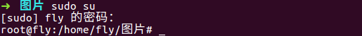
+ 说到安装软件，linux最有特点的就是命令行，所有操作都能在命令行下完成，通过命令行来安装软件，但是很多时候我们并不清楚自己要安装的软件具体是哪一个，这时候**apt-cache search 软件名称的一部分**，就能显示出多个软件共我们选择，还是以flashplugin为例。
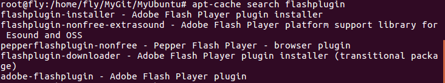
根据介绍，选择一个我们需要的软件，使用**apt-get install 软件名**来安装就可以了。
>到这里一些基本的操作已经可以进行了，要想搭建程序开发环境，还需要安装其他程序。
***
**安装sublime text 3**

sublime text 是一个跨平台的，好用的文本编辑器，可以用来编写C，html,php等文件。首先去sublime text官网下载最新版本。


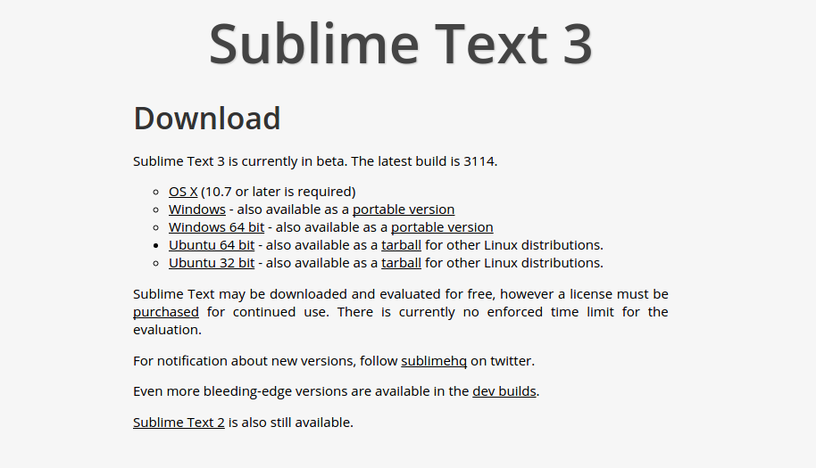


下载的是.deb软件包，通过dpkg -i ***.deb安装。sublime text需要破解一下，。网上搜的注册码。


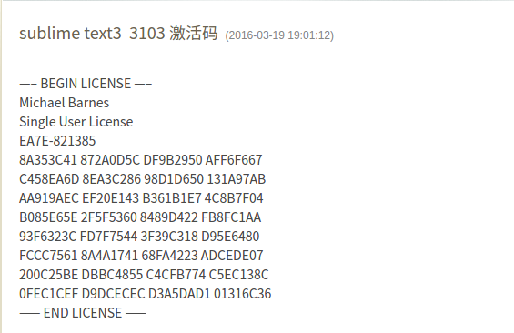


复制License中的内容，Sublime Text，执行 Help->Enter license 粘贴你的License，点击OK，重启Sublime Text即可看到你的注册信息。注册之后可以安装很多好用的插件，提高编程的效率。通过PackageControl组件安装插件。

1. 按Ctrl+`调出console（注：安装有QQ输入法的这个快捷键会有冲突的，输入法属性设置-输入法管理-取消热键切换至QQ拼音)。
2. 粘贴以下代码到底部命令行并回车：
`
import urllib.request,os; pf = 'Package Control.sublime-package'; ipp = sublime.installed_packages_path(); urllib.request.install_opener( urllib.request.build_opener( urllib.request.ProxyHandler()) ); open(os.path.join(ipp, pf), 'wb').write(urllib.request.urlopen( 'http://sublime.wbond.net/' + pf.replace(' ','%20')).read())
`
3. 重启sublime text3，如果在Perferences->package settings中看到package control这一项，则安装成功。


**用package control安装插件的方法：**


1. 按下Ctrl+Shift+P调出命令面板。
2. 输入install调出install package选项回车，然后再列表中选重要安装的插件。有很多好用的插件，这里就不再一一介绍了。

**sublimetext中文输入**

不要以为这样sublimetext就完全装好了，作为一个要经常用的中文的程序员，在sublimetext中输入中文乱码，是不能够接受地。接下来就说说，怎么在sublimetext中输入中文。


+ 保存下面的代码到文件sublime_imfix.c(位于~目录)
```
    #include <gtk/gtkimcontext.h>
    void gtk_im_context_set_client_window (GtkIMContext *context,GdkWindow *window)
    {
        GtkIMContextClass *klass;
        g_return_if_fail (GTK_IS_IM_CONTEXT (context));
        klass = GTK_IM_CONTEXT_GET_CLASS (context);
        if (klass->set_client_window)
            klass->set_client_window (context, window);
        g_object_set_data(G_OBJECT(context),"window",window);
        if(!GDK_IS_WINDOW (window))
            return;
        int width = gdk_window_get_width(window);
        int height = gdk_window_get_height(window);
        if(width != 0 && height !=0)
            gtk_im_context_focus_in(context);
    }
```
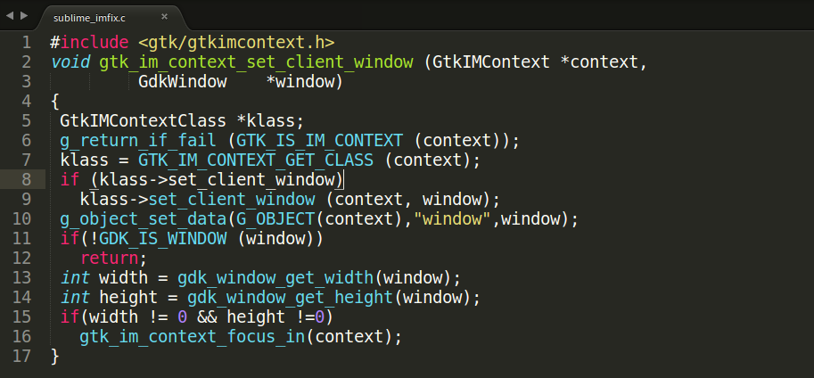

+ 将上一步的代码编译成共享库libsublime-imfix.so，命令
`
cd ~
gcc -shared -o libsublime-imfix.so sublime_imfix.c  `pkg-config --libs --cflags gtk+-3.0` -fPIC
`  
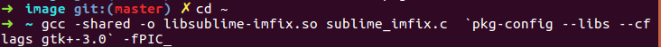  
在这里要注意一点，`pkg-config --libs --cflags gtk+-3.0`用到了gtk+-3.0，因为我的电脑中装的是gtk+3.0版本，有的可能是2.0版本，这里命令根据自己情况进行修改。可以使用`pkg-config --list-all grep gtk`来查看电脑中装的gtk版本。

+ 然后将libsublime-imfix.so拷贝到sublime_text所在文件夹sudo mv libsublime-imfix.so /opt/sublime_text/
+ 修改文件/usr/bin/subl的内容`sudo gedit /usr/bin/subl`将`#!/bin/sh
exec /opt/sublime_text/sublime_text "$@"`修改为`#!/bin/sh
LD_PRELOAD=/opt/sublime_text/libsublime-imfix.so exec /opt/sublime_text/sublime_text "$@"`
此时，在命令中执行 subl 将可以使用搜狗for linux的中文输入。
+ 为了使用鼠标右键打开文件时能够使用中文输入，还需要修改文sublime_text.desktop的内容。命令`sudo gedit /usr/share/applications/sublime_text.desktop`
将[Desktop Entry]中的字符串
Exec=/opt/sublime_text/sublime_text %F
修改为
Exec=zsh -c "LD_PRELOAD=/opt/sublime_text/libsublime-imfix.so exec /opt/sublime_text/sublime_text %F"
将[Desktop Action Window]中的字符串
Exec=/opt/sublime_text/sublime_text -n
修改为
Exec=zsh -c "LD_PRELOAD=/opt/sublime_text/libsublime-imfix.so exec /opt/sublime_text/sublime_text -n"
将[Desktop Action Document]中的字符串
Exec=/opt/sublime_text/sublime_text --command new_file
修改为
Exec=zsh -c "LD_PRELOAD=/opt/sublime_text/libsublime-imfix.so exec /opt/sublime_text/sublime_text --command new_file"
注意：
修改时请注意双引号"",否则会导致不能打开带有空格文件名的文件。
此处仅修改了/usr/share/applications/sublime-text.desktop，但可以正常使用了。opt/sublime_text/目录下的sublime-text.desktop可以修改，也可不修改。
同时，exex=zsh并不是一定的，根据自己ubuntu所使用的shell来确定。可以通过`exho $SHELL`来确定当前是用的shell。

到这里，就可以在sublimetext中输入中文了。
***
**简单说说lamp环境搭建**

因为我的电脑安装的是ubuntu16最新版本，配套的apache2，php7，mysql5和相关的扩展插件。值得注意的是，ubuntu16选用了php7而抛弃了php5所以，一开始我的时候，我安装php5一直不能成功。

为了方便后面适用git,我需要调整apache2默认的路径。apache2安装后默认的根路径是/var/www。

+ 直接编辑/etc/apache2/sites-available/default,将DocumentRoot设置为新路径，同时将Directory节点也改为新路径。
然后重启Web Server：sudo service apache2 restart  
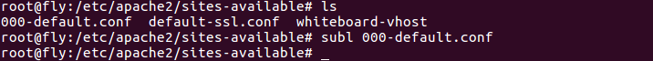  
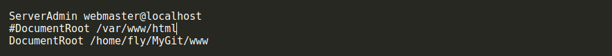  
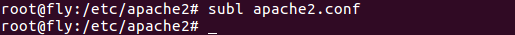  
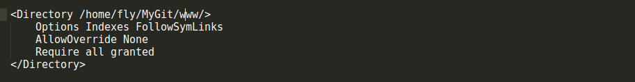  
真正做完这些之后，apache2的路径就修改为/home/fly/MyGit/www了。

**git相关问题**

+ git安装比较简单`sudo apt-get install git`就可以了。  
+ 在有就是注册一个github账号，这方便你查看更多的开源项目，和共享自己的代码。  
+ 建立ssh链接，首先要产生ssh秘钥。`$ ssh-keygen -t rsa -C "youremail@example.com"`你需要把邮件地址换成你自己的邮件地址，然后一路回车，使用默认值即可，由于这个Key也不是用于军事目的，所以也无需设置密码。如果一切顺利的话，可以在用户主目录里找到.ssh目录，里面有id_rsa和id_rsa.pub两个文件，这两个就是SSH Key的秘钥对，id_rsa是私钥，不能泄露出去，id_rsa.pub是公钥，可以放心地告诉任何人。  
+ 登陆GitHub，打开“Account settings”，“SSH Keys”页面：然后，点“Add SSH Key”，填上任意Title，在Key文本框里粘贴id_rsa.pub文件的内容：  
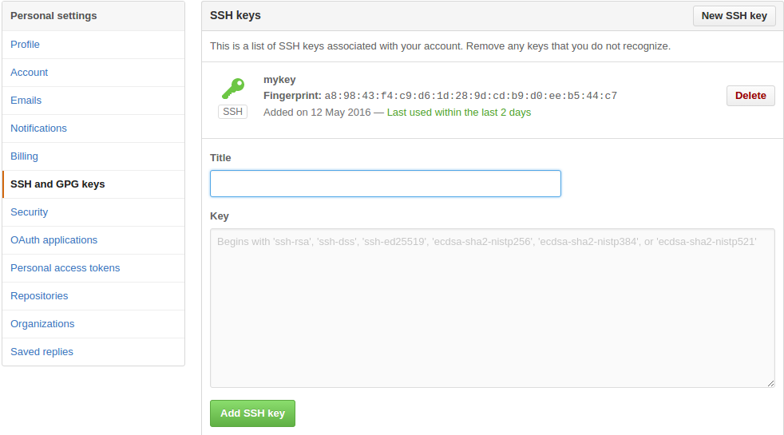  
当然，GitHub允许你添加多个Key。假定你有若干电脑，你一会儿在公司提交，一会儿在家里提交，只要把每台电脑的Key都添加到GitHub，就可以在每台电脑上往GitHub推送了。  
+ 测试ssh链接是否成功，`ssh -T git@github.com`,显示如下内容，则连接成功。  
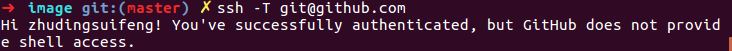  
+ github仓库建立，和本地仓库建立联系的两种常用方法。一种是，在github new repository并且初始化README文件，在本地终端中克隆。  
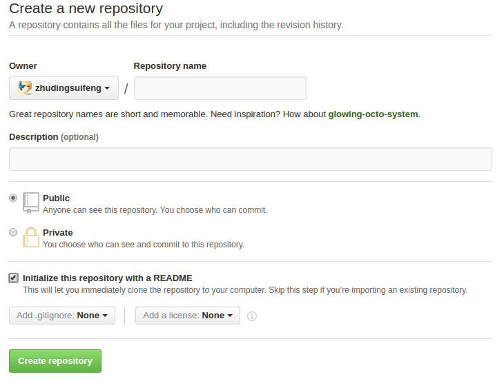  
`git clone git@github.com:zhudingsuifeng/MyUbuntu.git`就会在本地创建一个Myubuntu仓库，并且因为是克隆而来的，远程分支已经配置好了，不需要手动配置。  
还有一种是，在github新建一个空仓库，不init with README文件，在本地键一个和远程仓库同名的本地仓库。  
`mkdir MyUbuntu`  
`cd MyUbuntu`  
`git init`  
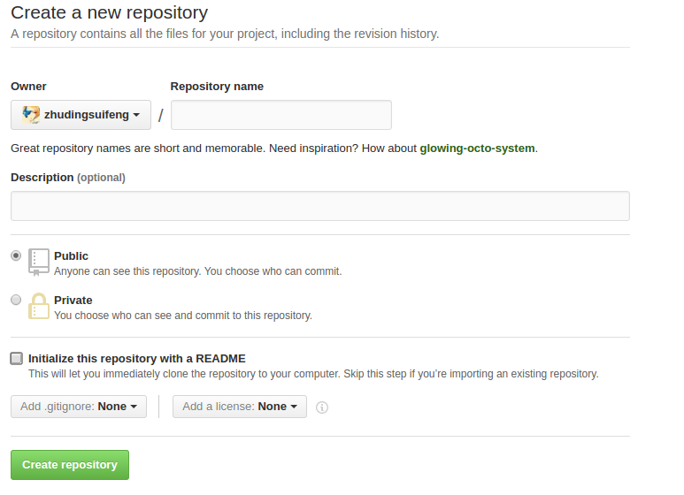  
之后为本地仓库添加远程分支:  
`$ git remote add origin git@github.com:zhudingsuifeng/MyUbuntu.git`  
`git push --set-upstream origin master`  
这样远程仓库和本地仓库的连接就建立了。  

**很多软件通过apt-get install vsftpd安装之后，自己手动配置，/etc/vsftpd.conf文件，等把这个文件删除之后，在通过apt-get remove vsftpd删除软件，重新安装，发现/etc/vsftpd.conf文件并不会自动回来。这个时候要通过apt-get remove --purge vsftpd来彻底删除软件，重新安装之后，/etc/vsftpd.conf文件旧找回来了。**  
虚拟机中一些常用的快捷键：  

+ ctrl+alt+enter使虚拟机进入全屏，或者进入普通界面。  
+ ctrl+alt+esc虚拟机捕捉鼠标，或者释放鼠标。  
其实在虚拟机中所装的操作系统，也是桌面操作系统的时候，这些快捷键一般用不到。但是在虚拟机中安装linux，并且使用文本界面，如果不知道如何释放和捕捉鼠标，将会是很难受的一件事情。  
***
另外，想要实现linux系统，文本界面很桌面系统的切换，可以修改/etc/inittab文件，使得系统默认启动后就运行文本界面，或者桌面系统。在文本界面下，可以通过ctrl+alt+F1~F6来切换系统提供的6个终端，或者通过startx启动桌面。在桌面系统的时候，注销用户，就再次回到文本界面。  
**在centos7中，修改默认的启动级别有些不一样。**  
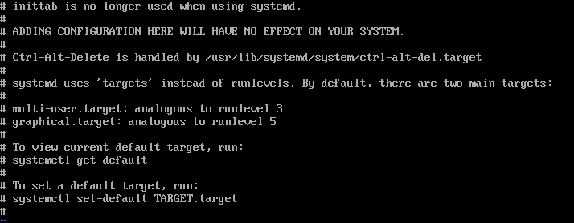  
通过命令的形式来设置默认的启动级别，`systemctl set-default multi-user.target`，即多用户模式。
**man命令后面跟的数字意思(并不是自己加上去的，而是自动显示的)**
- （1）用户可以操作的命令或者是可执行文件
- （2）系统核心可调用的函数与工具等
- （3）一些常用的函数与数据库
- （4）设备文件的说明
- （5）设置文件或者某些文件的格式
- （6）游戏
- （7）惯例与协议等
- （8）系统管理员可用的管理条令
- （9）与内核有关的文件
