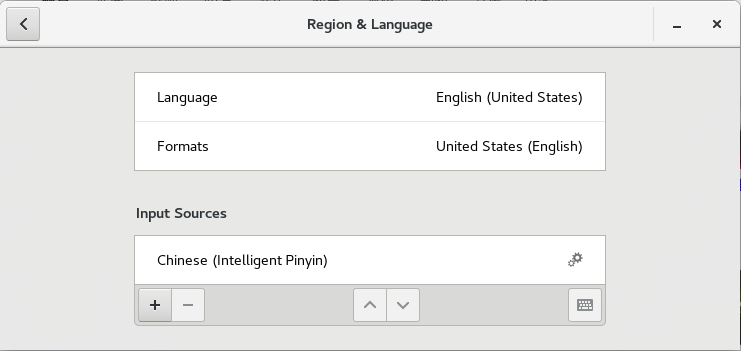

## cnetos7
#### install teamviewer12 on centos7
- download the teamviewer12 rpm package.
- visit the https://www.teamviewer.com/en/download/linux/
- install teamviewer12 rpm
- rpm -ivh teamviewer12 package
- error:Failed dependencies:...
- yum install teamviewer12 rpm #error solve
- yum will install depended package automatically.
#### support to chinese
- choose the chinese when install the centos7
- upper left corner->Applications->System tools->Settings->Region&language
- Language ->English(United States)
- Formats ->United States(English)
- Input Sources ->Chinese(Intelligent Pinyin)
- 这样就可以在显示英文的系统中输入中文。  

- Input Sources ->Options->Allow different sources for each window.  
